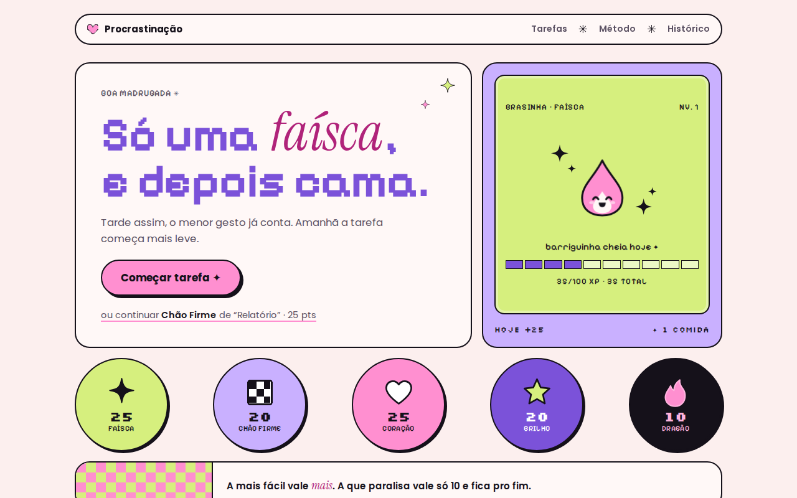

# Procrastinação

Um sistema baseado em estudos de TCC e DBT para lidar com a paralisia na hora de executar tarefas que travam.

## O método das 5 partes

Toda tarefa é dividida em 5 partes com pesos diferentes. Os pontos não medem esforço, medem progresso. Por isso a parte mais fácil vale mais que a mais difícil.

| Ordem | Parte | Pontos | Acumulado | O que é |
|---|---|---|---|---|
| 1 | **Faísca** | 25 | 25 | O primeiro gesto, sem nenhuma decisão e sem atrito. O objetivo é só engajar. |
| 2 | **Chão Firme** | 20 | 45 · saiu do zero | O que dá pra fazer até no seu pior dia. |
| 3 | **Coração** | 25 | 70 · completa | O núcleo. Feito isso, a tarefa está entregue. |
| 4 | **Brilho** | 20 | 90 · excelente | O aperfeiçoamento que deixa a tarefa extraordinária. |
| 5 | **Dragão** | 10 | 100 | A parte que mais paralisa. Vale pouco de propósito e fica por último. |

Faísca + Chão Firme já somam 45 pontos. A tarefa não está pronta, mas você saiu do zero e o dia seguinte começa mais leve.

## Os conceitos por trás

- **Ativação comportamental (TCC):** a motivação vem depois da ação. A Faísca existe pra agir primeiro, bem pequeno.
- **Ação oposta (DBT):** a emoção manda fugir, você faz o oposto em versão mínima.
- **Construir domínio (DBT):** fazer algo possível e um pouco desafiador ensina à mente que você dá conta.
- **Tarefa graduada (TCC):** você chega ao difícil subindo degraus.
- **Dialética (DBT):** o que você fez já basta *e* você pode ir além.
- **Aceitação radical (DBT):** o Dragão é difícil. Você não precisa gostar dele, só fazer depois do resto.

## A Brasinha

A mascote do app. Ela come cada Faísca que você conclui (+10 XP) e os pontos de todas as partes viram experiência. A cada 100 XP ela sobe de nível e evolui: Faísca, Chaminha, Brasa, Fogueira e Fênix.

Ela nunca morre nem fica triste com você. No máximo cochila e espera. Sem streak, sem culpa.

## Como usar

É um arquivo só. Abra o `index.html` no navegador ou publique com GitHub Pages (Settings → Pages → branch `main`, pasta raiz).

- As tarefas ficam salvas no `localStorage` do navegador.
- Nada é enviado pra servidor nenhum.
- Timer de 2, 5 ou 10 minutos pra cada parte.
- Histórico com pontos da semana e tarefas que saíram do zero.

## Stack

HTML, CSS e JavaScript puros, sem build e sem dependências. Fontes do Google Fonts: Pixelify Sans, Silkscreen, Instrument Serif e Poppins.

> Este app apoia hábitos e não substitui acompanhamento com um profissional de saúde mental.
